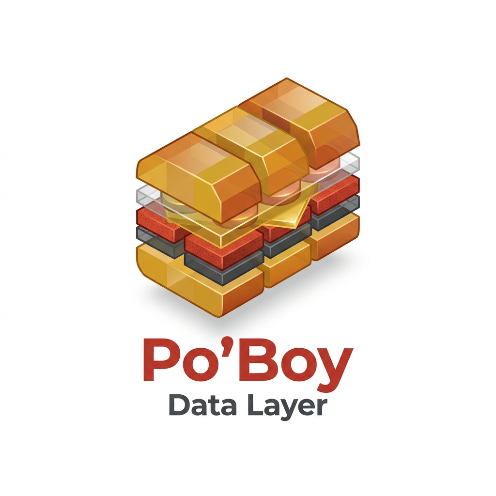

<p align="center">
  
</p>

# Po'Boy Data Layer (Standalone Edition) 🥪⚡

> **A fast, 1-click Google Tag Manager Data Layer Publisher and campaign parameter vault - ZERO backend required!**
> **GitHub Repository:** `github.com/dadelonglegs/poboy-data-layer`

---

## 💡 What is Po'Boy Data Layer?

Po'Boy Data Layer is a lightweight, 100% client-side data layer publisher. It recognizes returning visitors, remembers campaign parameters (`utm_source`, `gclid`, `fbclid`, etc.) across sessions, and pushes rich telemetry data into `window.dataLayer`.

> 📢 **Looking for the Full Analytics Dashboard & Server Suite?**
> If you want a self-hosted analytics dashboard, interactive heatmaps, private SQLite logging, and raw CSV exports, check out [**Po'Boy Server Side Analytics**](https://github.com/dadelonglegs/poboy)!

---

## 🔥 Key Features

* **1-Click GTM Import**: Import `GTM_POBOY_STANDALONE.json` directly into GTM to begin publishing events in seconds.
* **1st-Party Cookie Retention**: Recognizes returning visitors automatically with long-lasting apex domain cookies and LocalStorage sync.
* **Friendly User Handles**: Gives every visitor a unique handle (e.g. `SmokedProvolone-4820`) so you can track user journeys easily in GTM.
* **Campaign Parameter Vault**: Captures and remembers all URL parameters (`utm_source`, `utm_campaign`, `gclid`, `fbclid`, etc.) across every page view.
* **Instant Metadata Extraction**: Pulls page titles, meta descriptions, and main headings directly into `window.dataLayer`.
* **Optional GPS Location Prompt**: Can request native browser location access and fire `poboy_gps_updated`.
* **Organized Folder Tree in GTM Preview**: Groups 70+ variables into clean, collapsible folders for effortless debugging in GTM Preview window.
* **Sub-Millisecond Speed**: Runs in `< 0.4ms` with zero page load impact.

---

## 🛠️ Installation Methods

### Method A: 1-Click GTM Import (Recommended - Zero External Files Required)
If you use Google Tag Manager, **you do not need to host any `.js` files!** The tracking logic is pre-embedded inside the GTM container import:

1. Download **`GTM_POBOY_STANDALONE.json`** from this repository.
2. In Google Tag Manager, go to **Admin ➔ Import Container**.
3. Select `GTM_POBOY_STANDALONE.json` and choose **Merge**.
4. Publish your workspace!

---

### Method B: Direct HTML Script Tag (For Non-GTM Websites)
If your website does not use Google Tag Manager (e.g. custom HTML, WordPress, Shopify, or Webflow), you can include **`poboy-standalone.js`** directly in your website `<head>`:

```html
<script src="poboy-standalone.js" async></script>
```

---

## 🔗 Related Projects

* [**Po'Boy Server Side Analytics**](https://github.com/dadelonglegs/poboy) - Self-hosted analytics dashboard, SQLite logging, heatmaps, and web form auto-filling.

---

## 📜 License
Open Source under the MIT License. Built with ❤️ by the Po'Boy team.
